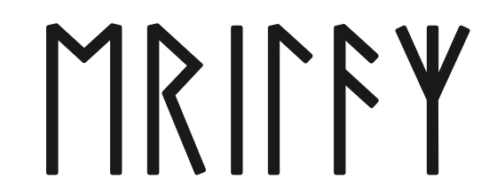
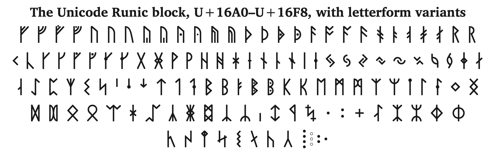
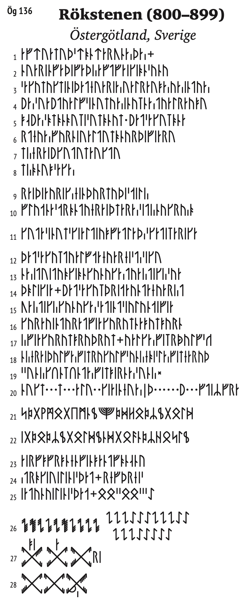
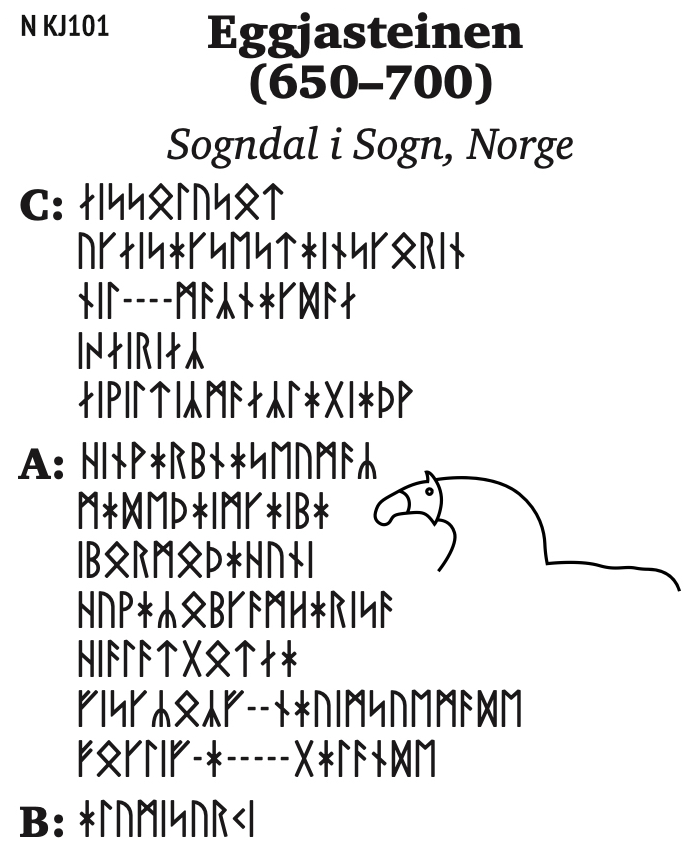
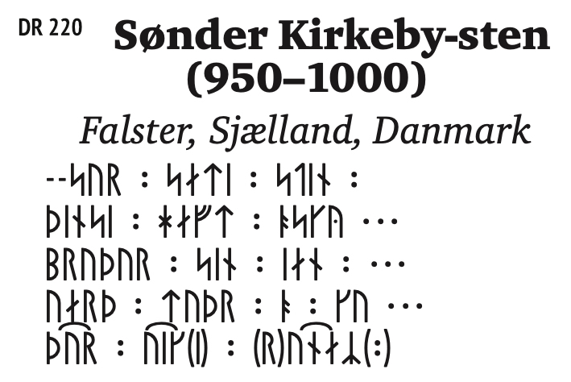
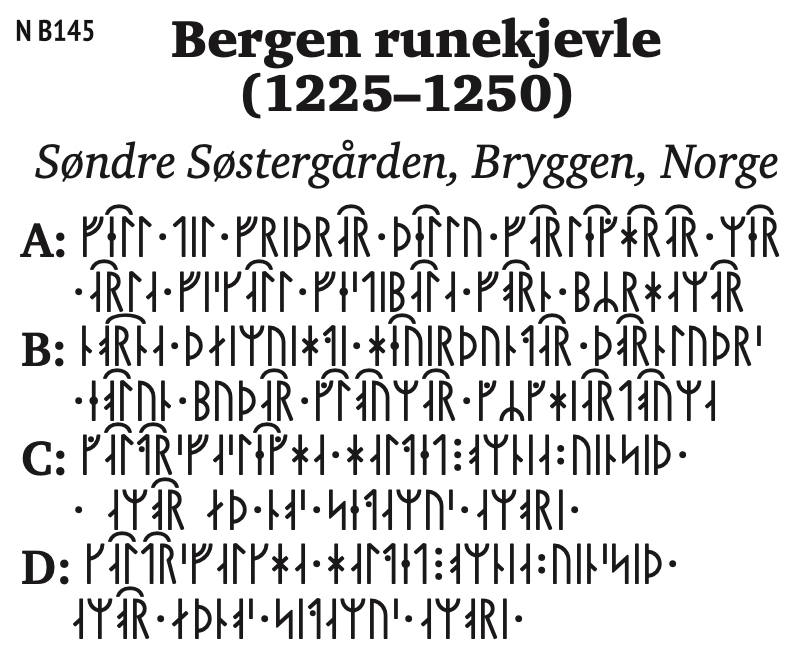
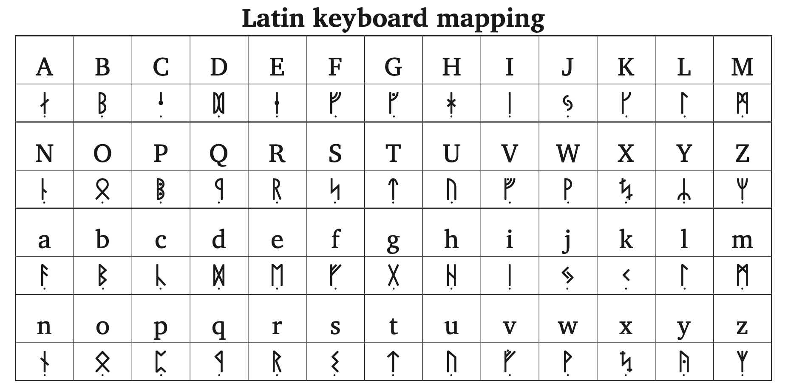

# Erilaz

<p align="center">
  
</p>

A runic typeface covering the complete Unicode Runic block (U+16A0–U+16FF),
with historical letterform variants for the Elder Futhark, the Anglo-Saxon
Futhorc, the Younger Futhark and the medieval futhorks.



Version 1.000 · 488 glyphs · OpenType/CFF · SIL Open Font License 1.1

## Coverage

All 89 assigned code points of the Unicode Runic block are encoded. The
remaining seven positions, U+16F9–U+16FF, are unassigned in Unicode itself.

The design is drawn from the inscriptions and manuscripts rather than from
existing digital revivals. Beyond the base repertoire the font carries
alternate forms for most runes: long-branch and short-twig shapes, staveless
runes, cipher runes, tent runes (*tjaldrúnir*) and a set of bind runes.

Where a variant comes from a particular monument, it is recorded in
[documentation/sources.md](documentation/sources.md).

## Examples

Inscriptions set in Erilaz, with the editorial apparatus a runic text needs:
brackets for uncertain readings, dashes for lost characters, ellipses for
lacunae, and the arcs of bind runes.

| | |
|---|---|
|  |  |
| **Rök stone**, Ög 136, Östergötland, 800–899 | **Eggja stone**, N KJ101, Sogndal, 650–700 |
|  |  |
| **Sønder Kirkeby stone**, DR 220, Falster, 950–1000 | **Bergen rune-stick**, N B145, Bryggen, 1225–1250 |

The Rök stone exercises the cipher features: `cv09`, `cv11` and the tent
runes of `cv12`–`cv13`.

Readings follow the standard published editions; they are given as
typesetting samples, not as new readings.

## OpenType features

| Feature | What it does |
|---|---|
| `cv01` | Rounded form, where the rune has one |
| `cv02`–`cv08` | Letterform variants attested in particular monuments |
| `cv09` | Staveless runes, set between superscript and subscript rules |
| `cv10` | Mirrored form, where one is attested |
| `cv11` | Cipher runes, Rök stone |
| `cv12`–`cv13` | Tent runes (*tjaldrúnir*), Rök stone |
| `cv14` | Cipher runes, "fish" |
| `cv15` | Cipher runes, "beards" |
| `cv19` | Staveless runes, without the rules |
| `salt` | Stylistic alternates |
| `dlig` | Bind runes |
| `aalt` | Access all alternates |

Registered for the `runr`, `latn` and `DFLT` scripts.

Eleven bind runes are available through `dlig`. Seven of them form when the
component runes are typed at their own code points; the remaining four —
k+r, k+z, k+h+z and x+z — form only from the Latin layer described below, or
can be picked directly from the glyph palette.

In CSS:

```css
@font-face {
  font-family: "Erilaz";
  src: url("Erilaz-Regular.woff2") format("woff2");
}
.long-branch { font-feature-settings: "cv04" 1; }
.bind-runes  { font-feature-settings: "dlig" 1; }
```

In Adobe InDesign and Adobe Illustrator the variants are reachable through
the Glyphs panel; in LibreOffice through the `Erilaz:cv04` font-name suffix.

## Typing from a Latin keyboard

Runes are awkward to enter on an ordinary keyboard, so the Latin letters
carry runes too. This is a convenience layer, not a transliteration
standard, and it sits on top of the proper Unicode coverage rather than
replacing it.

Three rules:

- **Uppercase gives the rounded form, lowercase the angular one.**
  Where a rune has no rounded variant, both cases give the same glyph.
- **Every rune entered this way carries a dot below it.** The dot marks
  the glyph as belonging to the keyboard layer, so that a rune typed from
  the Latin keyboard can be told apart from one entered at its own code
  point.
- **The text stays Latin.** What you type is `FUTHARK` rendered as runes,
  not ᚠᚢᚦᚨᚱᚲ. Copy it out of your layout and you get Latin letters back.
  For display work this does not matter; for anything that will be
  searched, sorted or processed later, enter the runes at their real code
  points instead.

The layer is also a convenient way to reach the variants: with a rune on
an ordinary key, the alternates panel in Adobe InDesign or Affinity
Publisher lists every `cv` form for it without hunting through the glyph
palette.



Erilaz cannot set Latin text — every Latin code point carries a rune.

## Files

```
fonts/otf/Erilaz-Regular.otf         release build
fonts/webfonts/Erilaz-Regular.woff2  web build
sources/Erilaz-Regular.vfc           design source, FontLab 7.2
sources/Erilaz-Regular.ufo           source, portable
documentation/specimen.pdf           printed specimen
documentation/sources.md             where each variant comes from
FONTLOG.txt                          version history
OFL.txt, LICENSE                     licence
```

## History

Drawn between August 2020 and January 2022 in FontLab, starting from vector
studies in Adobe Illustrator. The repertoire grew from 93 glyphs in the
first build to 488 in the release.

See `FONTLOG.txt` for the detailed record.

## License

SIL Open Font License, Version 1.1 — see `OFL.txt`.

“Erilaz” is a Reserved Font Name. You may use, modify and redistribute the
font freely, including commercially, but a modified version must be
released under a different name.

## Author

Eyvar Tjörvason (Evgenii Sitnikov) · [github.com/ristir](https://github.com/ristir)
